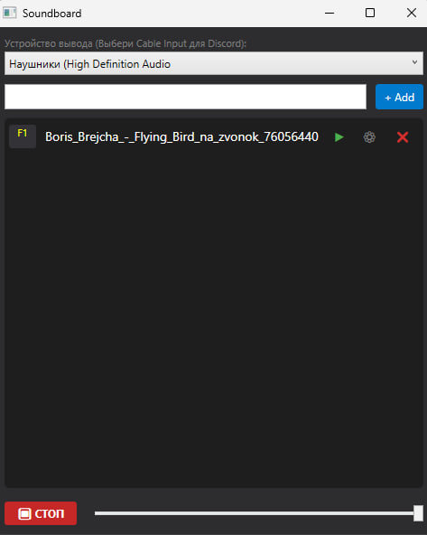

# 🎵 Soundboard (Soundpad Clone)

**WPF Soundboard** — это современное приложение для воспроизведения звуков в голосовых чатах и играх. Полный аналог программы Soundpad с открытым исходным кодом.

Приложение поддерживает **глобальные горячие клавиши**, позволяя воспроизводить звуки, находясь в игре, не сворачивая окна.



## ✨ Основные возможности

- **🎹 Глобальные горячие клавиши:** Перехват нажатий клавиш на низком уровне. Звуки работают, даже когда приложение свернуто или не в фокусе.
- **🎧 Маршрутизация звука:** Возможность выбора устройства вывода. Поддерживает трансляцию в виртуальные кабели (VB-Audio Cable) для работы в Discord, TeamSpeak и играх.
- **🎚️ Управление звуком:** Регулировка громкости в реальном времени и кнопка быстрой остановки (Stop).
- **📂 Drag & Drop:** Поддержка перетаскивания аудиофайлов (`.mp3`, `.wav`) прямо в окно программы.
- **🔍 Умный поиск:** Фильтрация списка звуков по названию.
- **💾 Сохранение состояния:** Список звуков, настройки клавиш и громкости сохраняются в `JSON` и восстанавливаются при запуске.
- **🎨 Modern UI:** Темный интерфейс в стиле Visual Studio / Discord.

## 🛠 Технологический стек

Проект написан в соответствии с принципами чистой архитектуры **MVVM** (Model-View-ViewModel).

*   **Язык:** C# (WPF)
*   **Аудио-движок:** [NAudio](https://github.com/naudio/NAudio)
*   **MVVM Фреймворк:** [CommunityToolkit.Mvvm](https://github.com/CommunityToolkit/dotnet)
*   **Системные вызовы:** Win32 API (user32.dll) для реализации глобальных хуков клавиатуры.

## 🚀 Установка и запуск

### Предварительные требования
*   Windows 10 / 11
*   .NET 6.0 (или выше)

### Инструкция
1.  Склонируйте репозиторий:
    ```bash
    git clone https://github.com/Ab4kshin/soundboard.git
    ```
2.  Откройте файл решения `soundboard.sln` в Visual Studio.
3.  Visual Studio должна автоматически подтянуть нужные NuGet пакеты. Если этого не произошло, выполните команды в консоли диспетчера пакетов:
    ```powershell
    Install-Package NAudio
    Install-Package CommunityToolkit.Mvvm
    ```
4.  Нажмите **F5** для сборки и запуска.

## 🎮 Как использовать в Discord / Играх

Чтобы ваши собеседники слышали звуки, рекомендуется использовать виртуальный аудиокабель.

1.  Установите драйвер **VB-Audio Virtual Cable** (или аналог).
2.  Запустите **Soundboard**.
3.  В выпадающем списке сверху выберите устройство: `CABLE Input (VB-Audio Virtual Cable)`.
4.  В настройках **Discord** (или игры) выберите устройство ввода (микрофон): `CABLE Output`.

## 🏗 Структура проекта

```text
soundboard/
├── Models/             # Описание данных (SoundItem)
├── Services/           # Логика (Аудио, Хуки клавиатуры, Файлы)
├── ViewModels/         # Связь UI и логики (MVVM)
├── Views/              # Окна приложения (XAML)
└── soundboard.sln
